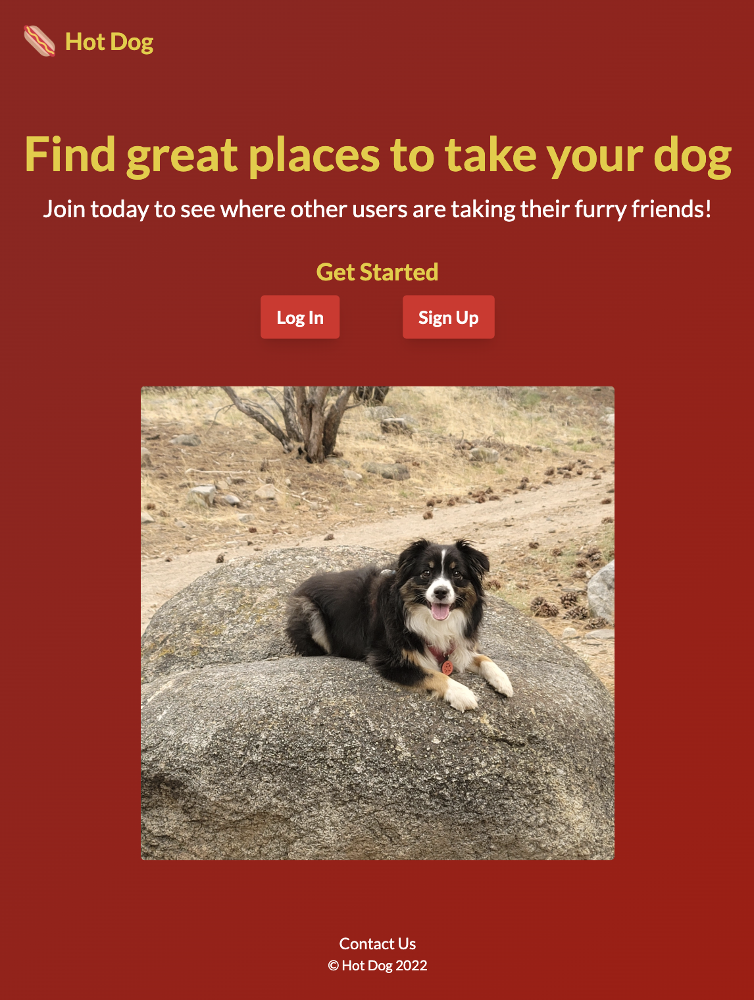

# Hot Dog

Hot Dog is an app built with your pet's best interest in mind.

Users can log in to access and contribute to a database of locations that are pet friendly. Looking for a rest stop with a grassy area nearby? Or a dog park with lots of trees for shade?

## Screenshots



## Tech Stack

Node.js, MongoDB, Express.js, Passport.js, Tailwind CSS

## Usage

View the live deployment here:

[Hot Dog App Live Deployment](https://conways-game.chadvidovcich.com/)

## Run Locally

**Requirements before starting:**

- [MongoDB Atlas URI](https://www.mongodb.com/atlas/database)
- [Cloudinary API Key](https://cloudinary.com)
<!-- - [Google Maps API Key](https://developers.google.com/maps) -->

Clone the project to your local environment

```bash
  git clone https://github.com/chadvidovcich/hot-dog.git
```

Go to the project directory

```bash
  cd hot-dog
```

Install dependencies

```bash
  npm install
```

Create environment variable file

```bash
  cd config
  touch .env
```

Add the following entries to the environment variable file (.env)

```bash
  PORT = 2121
  # MongoDB
  MONGO_URI = MONGODB-URI-PLACEHOLDER
  # Cloudinary
  CLOUD_NAME = CLOUD-NAME-PLACEHOLDER
  API_KEY = API-KEY-PLACEHOLDER
  API_SECRET = API-SECRET-PLACEHOLDER
```

Start the server in production mode

```bash
  npm run start
```

## Authors

- [@ChadVidovcich](https://www.github.com/chadvidovcich)

## License

[MIT](https://choosealicense.com/licenses/mit/)

## Roadmap

- Integrate Open UV Index API
- Integrate Open Weather Map API
